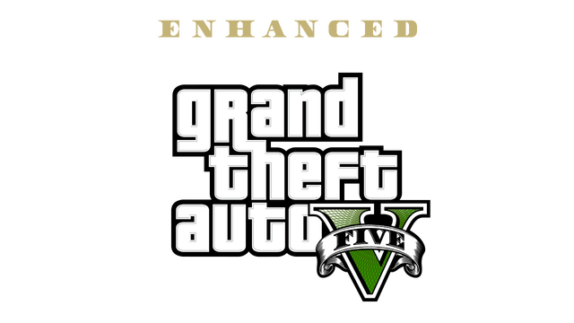

<p align="center">
  
</p>

<h1 align="center">GTA V Enhanced — Hands-Free Steam Launch</h1>

<p align="center">
  
  
  
</p>

<p align="center">
  Add <b>GTA V Enhanced</b> to Steam as a non-Steam game and launch it with a single
  click — no reaching for a mouse to click "Play" in Rockstar Games Launcher every
  time. Built for couch play: Steam Big Picture, Steam Link, and Xbox/PlayStation
  controllers over Steam Input.
</p>

---

## Why this exists

Rockstar Games Launcher's UI is built with Chromium (CEF). Its "PLAY" button is a
custom web-rendered element, not a native Windows control, so it doesn't expose
itself to Windows accessibility APIs — and Rockstar has no command-line flag or public
API to launch a specific title directly. `GTA5_Enhanced.exe` also refuses to run
standalone; Rockstar's DRM requires it to be launched *through* the Launcher, which
injects session/auth data at runtime.

So there's no "clean" way to automate this. This script does the next best thing:

1. Launches Rockstar Games Launcher directly.
2. Finds its window by title text (not `Process.MainWindowHandle`, which is
   unreliable for CEF apps — the visible window is often owned by a different
   internal process than the one PowerShell sees).
3. Tries UI Automation first (cheap, harmless, occasionally works on future
   Launcher versions).
4. Falls back to an image search for the "PLAY" button's actual pixels — restricted
   **only** to the live Launcher window's own screen rectangle, never the whole
   desktop — and clicks wherever it's actually found.
5. Waits for `GTA5_Enhanced.exe` to appear, brings it to the foreground, and
   minimizes Steam's Big Picture window if it's open (Big Picture won't auto-hide for
   a game it isn't directly tracking — this approach deliberately keeps GTA V outside
   Steam's hooked process tree, which is also what avoids a **"Steam client failed to
   initialize, please reinstall the game"** crash some setups hit otherwise).
6. Waits for the game to exit so Steam's "Playing" status stays accurate for the
   whole session, then cleans up leftover helper processes.

Works no matter which storefront your copy came from — Epic, Rockstar directly, or
Steam — since the Launcher app and `GTA5_Enhanced.exe` process name are identical
either way. (Already own it on Steam? You don't need any of this — just launch it
normally.)

## Setup

1. Clone/download this repo somewhere permanent, e.g. `D:\GTAV-AutoLaunch\`.
2. **Capture your own Play button image** — exact pixels shift slightly with Windows
   scaling/theme/resolution, so the included `playbutton.png` may not match yours:
   - Open Rockstar Games Launcher manually.
   - Press `Win+Shift+S`, tightly crop just the **PLAY** button (a little surrounding
     background is fine).
   - Save it over `playbutton.png` in this folder.
3. In Steam: **Add a Non-Steam Game** → browse to:
   ```
   C:\Windows\System32\WindowsPowerShell\v1.0\powershell.exe
   ```
4. Right-click the new shortcut → **Properties**, then set:
   - **Launch Options**:
     ```
     -ExecutionPolicy Bypass -WindowStyle Hidden -File "D:\GTAV-AutoLaunch\LaunchGTAV.ps1"
     ```
     (adjust the path to wherever you put this folder)
   - **Start In**: the same folder
5. Rename the shortcut to whatever you like (e.g. "Grand Theft Auto V").
6. Launch it from Steam, Big Picture, or Steam Link — that's it.

## Make it look like a real Steam game

<p align="center">
  
  &nbsp;&nbsp;
  
</p>

The `steam-artwork/` folder has the official GTA V Enhanced store assets, pulled
straight from Steam's own CDN (the game is also sold on Steam under app id
`3240220`), so your shortcut doesn't have to sit there as a blank tile.

| File | Steam slot | Size |
|---|---|---|
| `steam-artwork/grid_portrait.jpg` | Grid (Portrait) | 600×900 |
| `steam-artwork/header.jpg` | Grid (Landscape) | 460×215 |
| `steam-artwork/hero.jpg` | Hero | 1920×620 |
| `steam-artwork/logo.png` | Logo | 640×360 |

**To apply them:**

1. Add the shortcut to Steam first (see Setup above) and restart Steam if it was
   already open.
2. In your Steam **Library**, find the new shortcut and right-click it.
3. Choose **Manage** → **Set Custom Artwork** (older Steam clients: **Manage** →
   **Edit Steam Grid Image**).
4. A picker opens with tabs/slots for **Grid**, **Hero**, and **Logo** — for each
   one, click it and browse to the matching file from the table above.
5. For the **Icon** (shown in your taskbar/desktop, not part of the picker above):
   right-click the shortcut → **Properties**, and set the icon path directly to your
   `GTA5_Enhanced.exe` — Steam will pull the real embedded icon rather than needing an
   image file.
6. Back out to your Library view — the tile now looks like any other Steam game.

## Troubleshooting

The script writes a timestamped log to `launch_log.txt` in the same folder on every
run — check it first. It records:
- Whether the Launcher window was found, and its handle
- Whether UI Automation found/clicked a button
- The actual screen rectangle it searched for the Play button image, and whether it
  found a match
- Whether `GTA5_Enhanced.exe` was ever detected

If the image match keeps failing, re-capture `playbutton.png` (see Setup step 2) —
that's the single most common thing that needs adjusting per-machine.

## Notes / limitations

- Assumes the default Rockstar Games Launcher install path
  (`C:\Program Files\Rockstar Games\Launcher\Launcher.exe`). Edit `$launcherExe` at
  the top of the script if yours differs.
- The image search only succeeds if "PLAY" is the button actually showing — i.e. GTA V
  Enhanced needs to be the last-viewed/selected title in the Launcher. If you have
  multiple Rockstar titles installed, make sure GTA V is selected the last time you
  used the Launcher manually.
- Not affiliated with Rockstar Games, Take-Two Interactive, Valve, or Epic Games.
  Automates clicking a button in an already-installed, legitimately-owned game's
  official launcher — nothing here bypasses DRM, authentication, or ownership checks.
- Use at your own risk. Rockstar could change their UI layout at any time and break
  the image match — you'd just need to recapture `playbutton.png`.

## Contributing

Issues and PRs welcome — especially if you've adapted this for other Rockstar
titles (RDR2 etc.) or found a more reliable way to locate the Play button.

## License

MIT — see [LICENSE](LICENSE).
