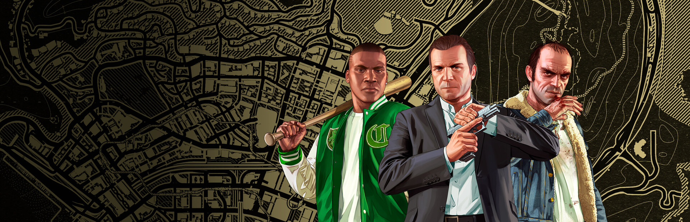
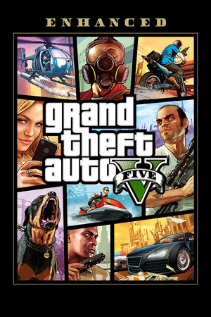
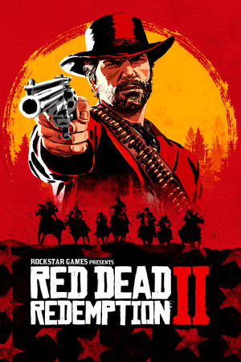

<p align="center">
  
</p>

<h1 align="center">Rockstar Games — Hands-Free Steam Launch</h1>

<p align="center">
  
  
  
  <a href="https://matthurley.dev"></a>
</p>

<p align="center">
  Add a Rockstar Games Launcher title to Steam as a non-Steam game and launch it with
  a single click — no reaching for a mouse to click "Play" in Rockstar's launcher
  every time. Built for couch play: Steam Big Picture, Steam Link, and
  Xbox/PlayStation controllers over Steam Input.
</p>

---

No coding or GitHub experience needed — just follow the steps below in order.
Everything here is free and uses only things already built into Windows and Steam.

## Supported games

| Game | Status |
|---|---|
| **GTA V Enhanced** | ✅ Verified working |
| **Red Dead Redemption 2** | ⚠️ Should work (same launcher, same pattern) but not yet confirmed by a real install — see note below |

Both games go through the same Rockstar Games Launcher and the same underlying
click-automation, so the same approach applies — see
[Adding another Rockstar title](#adding-another-rockstar-title-or-fixing-rdr2) if RDR2
needs a tweak on your system, and please open an issue either way to let others know
whether it worked for you.

## Setup

### 1. Download this project

- Click the green **Code** button near the top of this page → **Download ZIP**.
  *(If you'd rather grab a fixed, tested version instead of the latest code, use the
  [Releases page](../../releases) on the right side of this repo instead and download
  the zip attached to the newest release.)*
- Once downloaded, right-click the zip → **Extract All...** and pick a permanent
  location you won't move or delete later, e.g. `D:\RockstarSteamLaunch\`. (Anywhere
  works — just remember the folder, you'll need its path in step 3.)
- **If Windows shows a blue "Windows protected your PC" SmartScreen warning** when
  opening the zip or the folder: this is normal for any script downloaded from the
  internet that isn't digitally signed by a paid certificate (most free/hobby GitHub
  tools show this). Click **More info** → **Run anyway**, or just ignore it — nothing
  in this folder needs to be "run" directly; Steam will run the script for you later.

### 2. Pick your game's launch file and capture your own "PLAY" button image

This project has one file per game — use the one matching what you own:

| Game | Launch file | Button image to (re)capture |
|---|---|---|
| GTA V Enhanced | `LaunchGTAV.ps1` | `playbutton-gtav.png` |
| Red Dead Redemption 2 | `LaunchRDR2.ps1` | `playbutton-rdr2.png` |

The included button images were captured on one specific Windows setup — button
pixels can shift slightly with different display scaling, themes, or resolutions, so
it's best to replace the one for your game with your own:

1. Open Rockstar Games Launcher normally (double-click it like you always would), and
   make sure your game is the one currently selected/showing.
2. Once it's fully loaded and showing the PLAY button, press `Win+Shift+S` on your
   keyboard (Windows' built-in snipping tool — a small toolbar appears at the top of
   your screen).
3. Click and drag a tight box around just the **PLAY** button (a little bit of
   background around it is fine, but avoid capturing anything else like the
   promotional tiles next to it).
4. This copies the snip to your clipboard. Open **Paint** (search for it in the
   Start menu), press `Ctrl+V` to paste it in, then **File → Save As** → save it,
   using the exact filename from the table above, directly into the folder from
   step 1, replacing the existing file (choose "Yes" to overwrite when asked).

### 3. Add it to Steam

1. Open Steam, go to the **Library** tab.
2. Bottom-left corner, click **+ Add a Game** → **Add a Non-Steam Game...**
   (on some Steam versions this is under the **Games** menu at the top instead).
3. In the file browser that opens, paste this into the filename box and press Enter:
   ```
   C:\Windows\System32\WindowsPowerShell\v1.0\powershell.exe
   ```
4. Tick the checkbox next to it in the list, then click **Add Selected Programs**.
5. Find the new "powershell" entry in your Library, right-click it → **Properties**.
6. In the **General** tab of the Properties window, find the **LAUNCH OPTIONS** box
   near the bottom and paste one of these in — **but first edit the folder path** to
   match wherever you actually extracted this project in step 1:

   For **GTA V**:
   ```
   -ExecutionPolicy Bypass -WindowStyle Hidden -File "D:\RockstarSteamLaunch\LaunchGTAV.ps1"
   ```
   For **RDR2**:
   ```
   -ExecutionPolicy Bypass -WindowStyle Hidden -File "D:\RockstarSteamLaunch\LaunchRDR2.ps1"
   ```
7. Also find the **Target** and **Start In** fields near the top of the same tab —
   set **Start In** to your project folder path as well (e.g.
   `D:\RockstarSteamLaunch\`, no quotes needed there).
8. At the very top of the Properties window, rename the shortcut from "powershell"
   to something sensible like `Grand Theft Auto V` or `Red Dead Redemption 2`.
9. Close the Properties window. You're done — launch it from your Steam Library, Big
   Picture Mode, or Steam Link like any other game.

## Make it look like a real Steam game

<p align="center">
  
  &nbsp;&nbsp;
  
</p>

The `steam-artwork/` folder has the official store assets for both games, pulled
straight from Steam's own CDN (both games are also sold on Steam — GTA V Enhanced
under app id `3240220`, RDR2 under `1174180`), so your shortcut doesn't have to sit
there as a blank tile.

| File | Steam slot | Size |
|---|---|---|
| `steam-artwork/<game>/grid_portrait.jpg` | Grid (Portrait) | 600×900 |
| `steam-artwork/<game>/header.jpg` | Grid (Landscape) | 460×215 |
| `steam-artwork/<game>/hero.jpg` | Hero | 1920×620 |
| `steam-artwork/<game>/logo.png` | Logo | 640×360 |

(`<game>` is either `gtav` or `rdr2`, matching the game you set up.)

**To apply them:**

1. Add the shortcut to Steam first (see Setup above) and restart Steam if it was
   already open.
2. In your Steam **Library**, find the new shortcut and right-click it.
3. Choose **Manage** → **Set Custom Artwork** (older Steam clients: **Manage** →
   **Edit Steam Grid Image**).
4. A picker opens with tabs/slots for **Grid**, **Hero**, and **Logo** — for each
   one, click it and browse to the matching file from the table above.
5. For the **Icon** (shown in your taskbar/desktop, not part of the picker above):
   right-click the shortcut → **Properties**, and set the icon path directly to your
   game's real `.exe` (`GTA5_Enhanced.exe` or `RDR2.exe`) — Steam will pull the real
   embedded icon rather than needing an image file.
6. Back out to your Library view — the tile now looks like any other Steam game.

## Adding another Rockstar title (or fixing RDR2)

Every Rockstar Games Launcher title follows the same pattern: a launcher stub hands
off to a real, longer-running game process. Adding support for a game not listed
above (or correcting the RDR2 config if it doesn't match your install) takes three
steps:

1. Copy `LaunchGTAV.ps1`, rename it (e.g. `LaunchBully.ps1`), and open it in Notepad.
2. Change the two values near the top:
   ```powershell
   $GameProcessName = "PutTheRealProcessNameHere"
   $TemplateImageName = "playbutton-yourgame.png"
   ```
   To find the real process name: launch the game normally through Rockstar Games
   Launcher, then while it's running open Task Manager (`Ctrl+Shift+Esc`) → **Details**
   tab, and look for the process that's still there a minute or two after launch
   (ignore anything that appears briefly and disappears — that's the bootstrap stub,
   not the real game). Use the name **without** the `.exe` extension.
3. Capture a `playbutton-yourgame.png` the same way as step 2 in Setup above, using
   that game's own Rockstar Launcher screen.

Then point Steam's Launch Options at your new file the same way as the main Setup
section. `Launch-Core.ps1` (the shared engine both `LaunchGTAV.ps1` and
`LaunchRDR2.ps1` hand off to) doesn't need to be touched.

## How it works (technical details)

<details>
<summary>Click to expand — not needed to use the tool, just for the curious</summary>

Rockstar Games Launcher's UI is built with Chromium (CEF). Its "PLAY" button is a
custom web-rendered element, not a native Windows control, so it doesn't expose
itself to Windows accessibility APIs — and Rockstar has no command-line flag or public
API to launch a specific title directly. The game executables also refuse to run
standalone; Rockstar's DRM requires them to be launched *through* the Launcher, which
injects session/auth data at runtime.

So there's no "clean" way to automate this. `Launch-Core.ps1` does the next best
thing:

1. Launches Rockstar Games Launcher directly.
2. Finds its window by title text (not `Process.MainWindowHandle`, which is
   unreliable for CEF apps — the visible window is often owned by a different
   internal process than the one PowerShell sees).
3. Tries UI Automation first (cheap, harmless, occasionally works on future
   Launcher versions).
4. Falls back to an image search for the "PLAY" button's actual pixels — restricted
   **only** to the live Launcher window's own screen rectangle, never the whole
   desktop — and clicks wherever it's actually found.
5. Waits for the real game process (`GTA5_Enhanced` / `RDR2` / whichever the wrapper
   script configured) to appear, brings it to the foreground, and minimizes Steam's
   Big Picture window if it's open (Big Picture won't auto-hide for a game it isn't
   directly tracking — this approach deliberately keeps the game outside Steam's
   hooked process tree, which is also what avoids a **"Steam client failed to
   initialize, please reinstall the game"** crash some setups hit otherwise).
6. Waits for the game to exit so Steam's "Playing" status stays accurate for the
   whole session, then cleans up leftover helper processes.
7. Every step is wrapped so that any unexpected failure gets written to
   `launch_log.txt` with the full error and stack trace, rather than the window just
   flashing closed with nothing to go on.

Works no matter which storefront your copy came from — Epic, Rockstar directly, or
Steam — since the Launcher app and the game's process name are identical either way.
(Already own it on Steam? You don't need any of this — just launch it normally.)

</details>

## Troubleshooting

The script writes a timestamped log to `launch_log.txt` in the same folder on every
run — **always check it first.** It records every step: whether the Launcher window
was found, whether UI Automation or the image match found the Play button (and
exactly where it clicked), whether the real game process was ever detected, and — as
of the current version — a full error and stack trace for literally anything
unexpected that goes wrong, so a silent flash-and-close with no explanation shouldn't
happen anymore.

**The window flashes and closes almost instantly, and there's no `launch_log.txt` at
all**
This means PowerShell itself never got far enough to write anything — check that:
- Steam's **Launch Options** field has the *exact* text from Setup step 3.6, with
  the folder path edited to match where you extracted the project (a stray missing
  quote or wrong path is the most common cause).
- **Start In** is set to the same project folder.
- You're pointing at `LaunchGTAV.ps1` or `LaunchRDR2.ps1` — not `Launch-Core.ps1`
  directly (that one expects to be handed settings by one of the other two, and does
  nothing useful on its own).

To see the error directly instead of guessing: temporarily change `-WindowStyle
Hidden` to `-NoExit` in the Launch Options, and launch again — a normal PowerShell
window will stay open showing exactly what happened. Change it back to `-WindowStyle
Hidden` once you've fixed the issue.

**`launch_log.txt` exists but the real game process never appears**
The log will say `"<name>" never appeared within 180s`. This means
`$GameProcessName` in the wrapper script doesn't match what the game is actually
called once running. Follow the process-finding steps in
[Adding another Rockstar title](#adding-another-rockstar-title-or-fixing-rdr2) above
to find the correct name and update it.

**The Play button never gets clicked / lands in the wrong place**
Re-capture the button image (Setup step 2) — this is the single most common
per-machine adjustment needed, especially after a Rockstar Launcher UI update or on
a different display scaling setting than the original screenshot was taken on.

**Steam still shows "Playing" long after you've quit**
Same root cause as the process-name mismatch above — fix it the same way.

## Notes / limitations

- Assumes the default Rockstar Games Launcher install path
  (`C:\Program Files\Rockstar Games\Launcher\Launcher.exe`). Edit `$launcherExe` near
  the top of `Launch-Core.ps1` if yours differs.
- The image search only succeeds if "PLAY" is the button actually showing — i.e. your
  game needs to be the last-viewed/selected title in the Launcher. If you have
  multiple Rockstar titles installed, make sure the right one is selected the last
  time you used the Launcher manually.
- Not affiliated with Rockstar Games, Take-Two Interactive, Valve, or Epic Games.
  Automates clicking a button in an already-installed, legitimately-owned game's
  official launcher — nothing here bypasses DRM, authentication, or ownership checks.
- Use at your own risk. Rockstar could change their UI layout at any time and break
  the image match — you'd just need to recapture the button image.

## Contributing

Issues and PRs welcome — especially confirmation (or fixes) for RDR2's real process
name on your system, or wrapper scripts for other Rockstar titles.

## Author

Created by [Matt Hurley](https://matthurley.dev).

## License

MIT — see [LICENSE](LICENSE).
